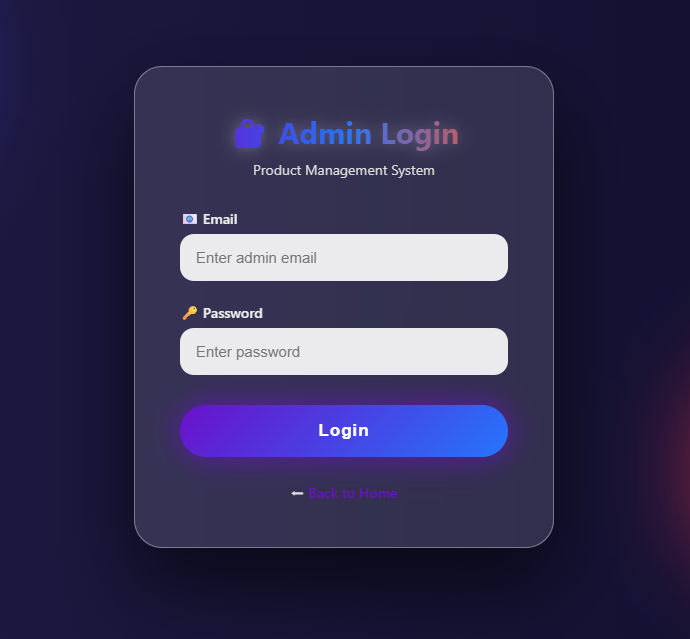
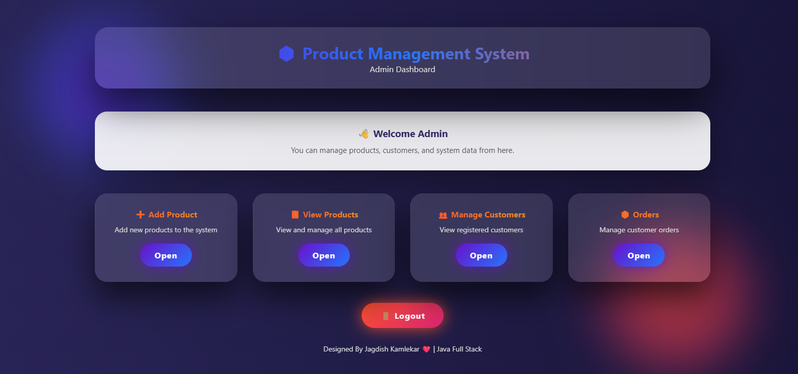
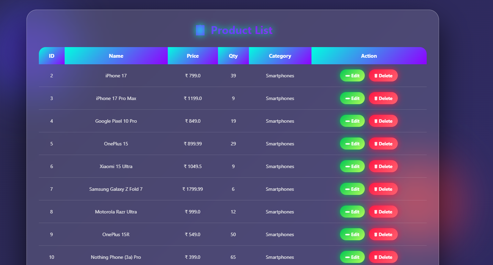
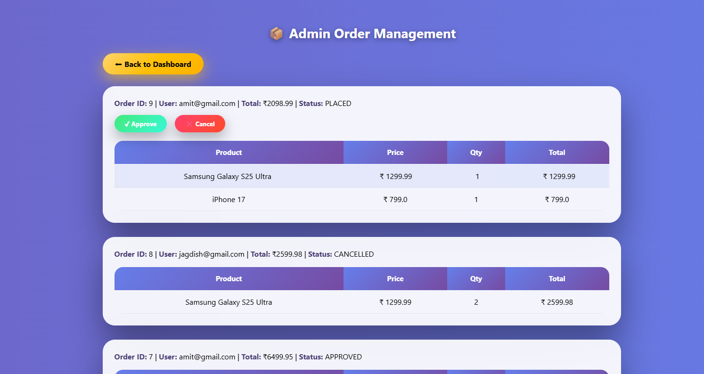
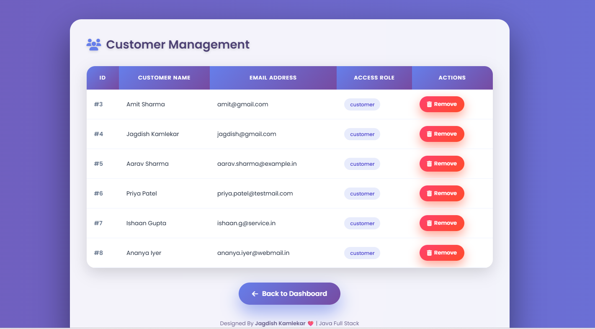
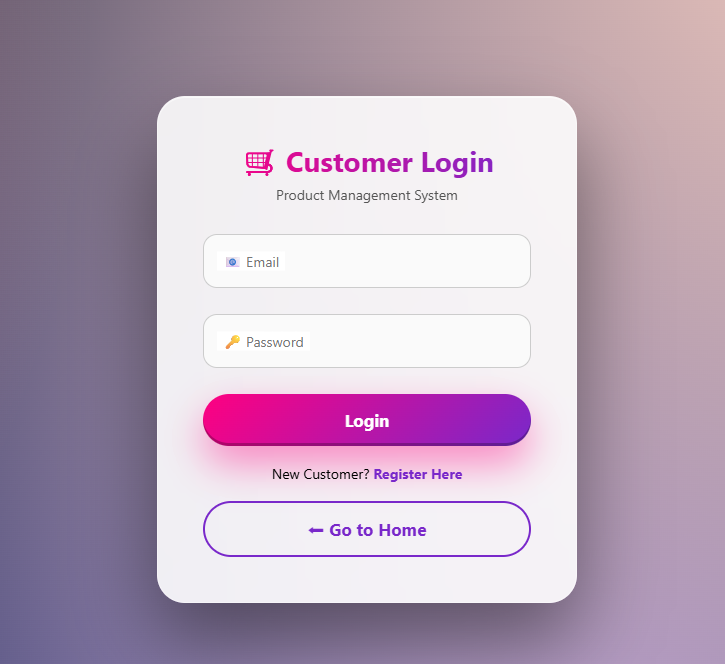
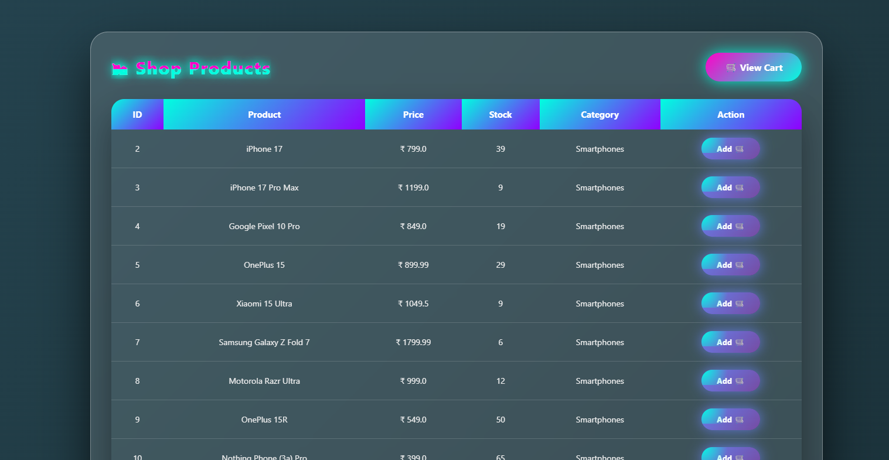
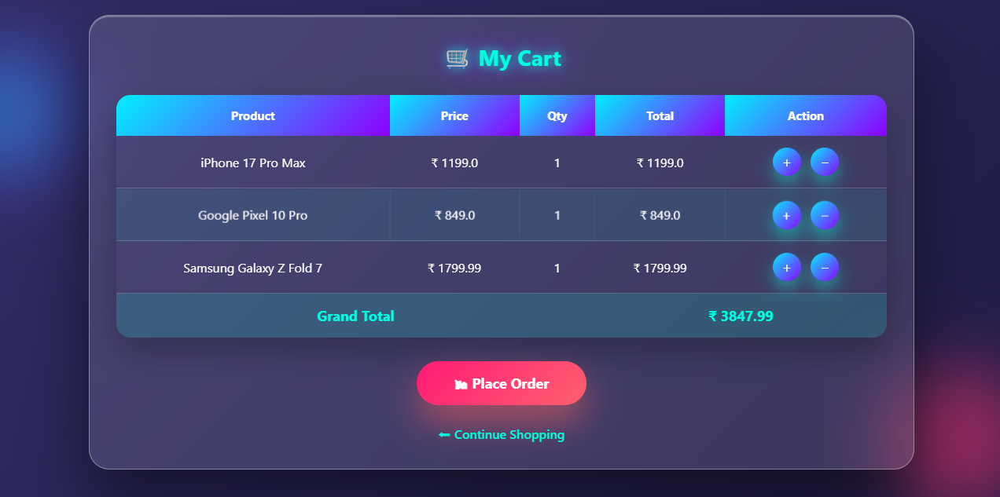
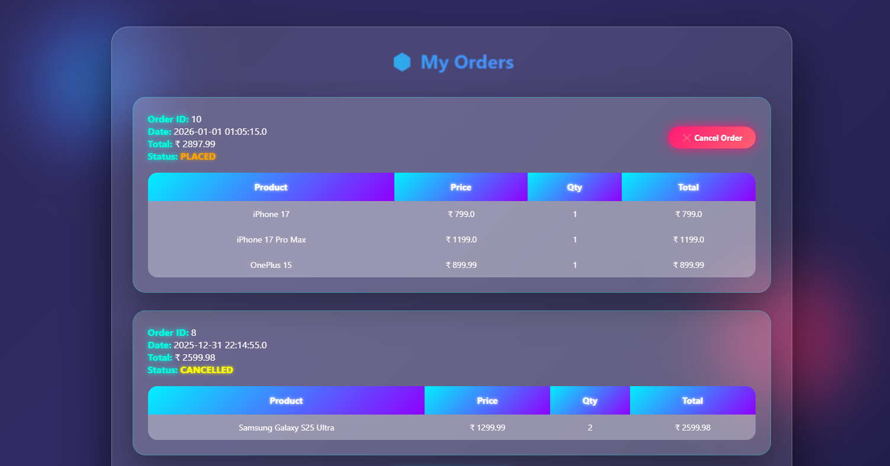

# 🛒 Online Product Management System (Java Servlet & JSP)

A full-stack **Online Product Management System** developed using **Java EE (Servlet, JSP, JDBC)**  
with **Role-Based Access Control (Admin & Customer)** and **MySQL database**.

This project demonstrates a real-world e-commerce workflow including product management, 
cart operations, order processing, admin approval, and stock handling.

---

## 🚀 Technologies Used

- Java (JDK 21)
- Servlet & JSP (MVC Architecture)
- JDBC
- Apache Tomcat 11
- MySQL Database
- HTML, CSS, JavaScript
- Session Management (HttpSession)

---

## 👤 User Roles

### 🔐 Admin
- Admin login
- Dashboard with statistics
- Add / Update / Delete products
- View all customers
- Remove customer (with transaction safety)
- View all orders
- Approve / Cancel orders
- Auto stock update on order approval

### 🛍 Customer
- Customer registration & login
- View products
- Add products to cart
- Update cart quantity
- Place order
- View order history
- Cancel order (only if status = PLACED)

---

## 🖼️ Project Screenshots

### 🔑 Admin Module

| Feature | Screenshot |
|------|-----------|
| Admin Login |  |
| Admin Dashboard |  |
| Manage Products |  |
| View Orders |  |
| View Customers |  |

---

### 👥 Customer Module

| Feature | Screenshot |
|------|-----------|
| Customer Login |  |
| Product List |  |
| Shopping Cart |  |
| My Orders |  |

---

## 🗄️ Database Structure

### Tables Used
- `users`
- `product`
- `cart`
- `orders`
- `order_items`

---

## 🔄 Order Flow

1. Customer adds product to cart
2. Customer places order
3. Order status = `PLACED`
4. Admin reviews order
5. Admin APPROVES or CANCELS
6. Stock auto-updates on approval

---

## 🔐 Security Features

- Session-based authentication
- Role-based authorization
- Protected admin pages
- Transaction handling for delete operations

---

## 🧠 Key Learning Outcomes

- MVC Architecture
- JDBC & PreparedStatement
- HttpSession tracking
- Transaction management
- Foreign key handling
- Real-world order workflow

---
